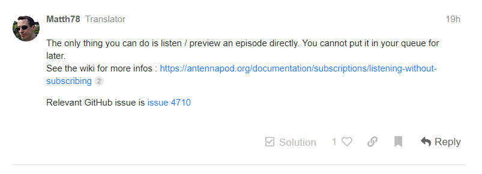

# Validação - Comunicação Informal

## Histórico de versões
| Data       | Versão | Descrição                              | Autor                                            | Revisor                                     |
| ---------- | ------ | -------------------------------------- | ------------------------------------------------ | ------------------------------------------- |
| 22.03.2022 | 1.0    | Criação do documento                   | [Matheus Calixto](https://github.com/matheuscvp) | [Yudi Yamane](https://github.com/yudi-azvd) |
| 23.03.2022 | 2.0    | Adição da resposta dos desenvolvedores | [Matheus Calixto](https://github.com/matheuscvp) | [Yudi Yamane](https://github.com/yudi-azvd) |

## Introdução

A Validação por Comunicação Informal baseia-se em entrar em contato com alguém que esteja ativo no projeto, por exemplo um desenvolvedor, e assim por meio de um diálogo validar se determinado(s) requisito(s) estão de acordo com o escopo do projeto.

## Metodologia

Para realizar a Validação por Comunicação Informal o membro do grupo [Matheus Calixto](https://github.com/matheuscvp), entrou em contato com os desenvolvedores do AntennaPod por meio do [Forúm do AntennaPod](https://forum.antennapod.org), onde foi levado para análise dos desenvolvedores o requisito:

| ID   | Descrição                                                                           | Priorização |
| ---- | ----------------------------------------------------------------------------------- | ----------- |
| RF01 | O usuário deve conseguir ouvir um episódio sem precisar se inscrever em seu podcast | 3,00        |

## Participantes

- [Matheus Calixto](https://github.com/matheuscvp)

## Resultados

 
Figura 1 - Postagem no Fórum  
Autor: Matheus

Após determinado periodo de tempo um dos envolvidos com o AntennaPod respondeu a postagem no fórum com a seguinte mensagem:

 
Figura 2 - Resposta do Fórum

De acordo com a resposta, permitir que um usuário ouvisse a um episódio de um podcast sem se increver no mesmo ainda não está implementado no aplicativo, como descrito na página da documentação do AntennaPod, disponivel no [link](https://antennapod.org/documentation/subscriptions/listening-without-subscribing), e descutido na [issue 4710](https://github.com/AntennaPod/AntennaPod/issues/4710) no repositório do AntennaPod, e por isso atualmente o aplicativo apenas dispõe de um preview do episódio, para um não inscrito.

## Referências

VAZQUEZ, Carlos Eduardo; SIQUEIRA SIMÕES, Guilerme. Engenharia de Requisitos: Software orientado ao negócio. 1. ed. rev. [S. l.: s. n.], 2016.