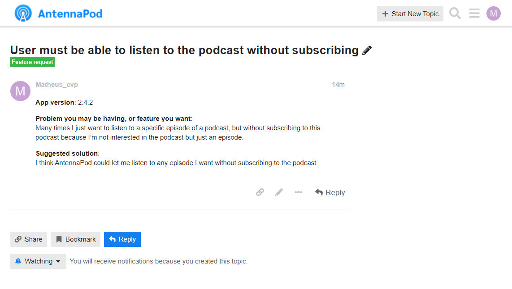

# Validação - Comunicação Informal

## Histórico de versões
| Data       | Versão | Descrição            | Autor                                            | Revisor |
| ---------- | ------ | -------------------- | ------------------------------------------------ | ------- |
| 22.03.2022 | 1.0    | Criação do documento | [Matheus Calixto](https://github.com/matheuscvp) |         |

## Introdução

A Validação por Comunicação Informal baseia-se em entrar em contato com alguém que esteja ativo no projeto, por exemplo um desenvolvedor, e assim por meio de um diálogo validar se determinado(s) requisito(s) estão de acordo com o escopo do projeto.

## Metodologia

Para realizar a Validação por Comunicação Informal o membro do grupo [Matheus Calixto](https://github.com/matheuscvp), entrou em contato com os desenvolvedores do AntennaPod por meio do [Forúm do AntennaPod](https://forum.antennapod.org), onde foi levado para análise dos desenvolvedores o requisito:

| ID   | Descrição                                                                           | Priorização |
| ---- | ----------------------------------------------------------------------------------- | ----------- |
| RF01 | O usuário deve conseguir ouvir um episódio sem precisar se inscrever em seu podcast | 3,00        |

## Participantes

- [Matheus Calixto](https://github.com/matheuscvp)

## Resultados

 
Figura 1 - Postagem no Fórum  
Autor: Matheus

Até o presente momento não obtivemos resposta por parte dos desenvolvedores do AntennaPod.

## Referências

VAZQUEZ, Carlos Eduardo; SIQUEIRA SIMÕES, Guilerme. Engenharia de Requisitos: Software orientado ao negócio. 1. ed. rev. [S. l.: s. n.], 2016.