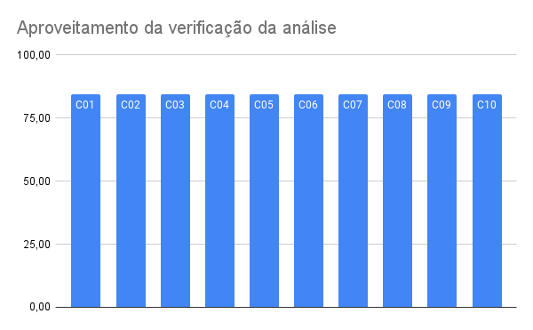

# Verificação - cenário

## Histórico de versões
| Data       | Versão | Descrição             | Autor                                       | Revisor                                          |
| ---------- | ------ | --------------------- | ------------------------------------------- | ------------------------------------------------ |
| 16.03.2022 | 1.0    | Criação do documento  | [Yudi Yamane](https://github.com/yudi-azvd) | [Matheus Fonseca](https://github.com/gatotabaco) |
| 19.04.2022 | 2.0    | Melhoria do documento | [Yudi Yamane](https://github.com/yudi-azvd) | [Matheus Fonseca](https://github.com/gatotabaco) |

[Cenários v1](./cenariosv1.md)

## Participantes

- [Yudi Yamane](https://github.com/yudi-azvd)

## Metodologia

A técnica de verificação usada nos artefatos de [cenários](/2021.2-AntennaPod/modelagem/cenarios/) 
é a inspeção, aplicada a partir do seguinte checklist, que tem como objetivo validar
a qualidade do documento e possíveis falhas/erros. 

| ID  | Descrição                                                         | Justificativa                                                                                    |
| --- | ----------------------------------------------------------------- | ------------------------------------------------------------------------------------------------ |
| 1   | O conceito de Cenário é apresentado?                              | O leitor deve entender o que está sendo apresentado no artefato                                  |
| 2   | O título é auto-explicativo?                                      | Deve ser possível obter uma noção geral do cenário ao ler seu título                             |
| 3   | O contexto apresenta pré-condição?                                | Deve-se saber quais são as condições necessárias para o cenário acontecer                        |
| 4   | O contexto apresenta local?                                       | Deve-se saber qual é o local                                                                     |
| 5   | O contexto apresenta tempo?                                       | É necessário saber quanto tempo leva para o cenário ocorrer                                      |
| 6   | Os atores estão presentes?                                        | Deve-se saber quem são os participantes do cenário                                               |
| 7   | Existem recursos?                                                 | Deve-se saber quais são os recursos necessários para a realização do cenário                     |
| 8   | Os episódios estão presentes?                                     | Deve ser a sequência de acontecimentos que descreve o cenário                                    |
| 9   | Os episódios estão claros?                                        | A clareza é importante para que os episódios sejam de fácil entendimento para quem lê o artefato |
| 10  | Existem restrições?                                               | Deve-se saber quais são as restrições dos atores no cenário                                      |
| 11  | Restrições não repetem informações da pré-condição e/ou recursos? | É um erro comum as informações de restrições e pré-condições serem repetidas                     |
| 12  | Existem exceções?                                                 | Exceções são situações nas quais o ator não atinge seu objetivo                                  |

## Checklist

|     | Critério                                                          | C01   | C02   | C03   | C04   | C05   | C06   | C07   | C08   | C09   | C10   |
| --- | ----------------------------------------------------------------- | ----- | ----- | ----- | ----- | ----- | ----- | ----- | ----- | ----- | ----- |
| 1   | O conceito de cenário é apresentado?                              | Sim   | Sim   | Sim   | Sim   | Sim   | Sim   | Sim   | Sim   | Sim   | Sim   |
| 2   | O título é auto-explicativo?                                      | Sim   | Sim   | Sim   | Sim   | Sim   | Sim   | Sim   | Sim   | Sim   | Sim   |
| 3   | O contexto apresenta pré-condição?                                | Sim   | Sim   | Sim   | Sim   | Sim   | Sim   | Sim   | Sim   | Sim   | Sim   |
| 4   | O contexto apresenta local?                                       | Sim   | Sim   | Sim   | Sim   | Sim   | Sim   | Sim   | Sim   | Sim   | Sim   |
| 5   | O contexto apresenta tempo?                                       | Não   | Não   | Não   | Não   | Não   | Não   | Não   | Não   | Não   | Não   |
| 6   | Os atores estão presentes?                                        | Sim   | Sim   | Sim   | Sim   | Sim   | Sim   | Sim   | Sim   | Sim   | Sim   |
| 7   | Existem recursos?                                                 | Sim   | Sim   | Sim   | Sim   | Sim   | Sim   | Sim   | Sim   | Sim   | Sim   |
| 8   | Os episódios estão presentes?                                     | Sim   | Sim   | Sim   | Sim   | Sim   | Sim   | Sim   | Sim   | Sim   | Sim   |
| 9   | Os episódios estão claros?                                        | Sim   | Sim   | Sim   | Sim   | Sim   | Sim   | Sim   | Sim   | Sim   | Sim   |
| 10  | Existem restrições?                                               | Sim   | Sim   | Sim   | Sim   | Sim   | Sim   | Sim   | Sim   | Sim   | Sim   |
| 11  | Restrições não repetem informações da pré-condição e/ou recursos? | Sim   | Sim   | Sim   | Sim   | Sim   | Sim   | Sim   | Sim   | Sim   | Sim   |
| 12  | Existem exceções?                                                 | Sim   | Sim   | Sim   | Sim   | Sim   | Sim   | Sim   | Sim   | Sim   | Sim   |
| 13  | Apresenta objetivo?                                               | Não   | Não   | Não   | Não   | Não   | Não   | Não   | Não   | Não   | Não   |
|     | Aproveitamento                                                    | 84,62 | 84,62 | 84,62 | 84,62 | 84,62 | 84,62 | 84,62 | 84,62 | 84,62 | 84,62 |
|     | Aproveitamento médio                                              | 84,62 |       |       |       |       |       |       |       |       |       |

## Conclusão

 
Figura 1 - Aproveitamento de cenários  
Autor: Yudi

Apesar do conceito de cenários ter sido apresentado, ele poderia ser melhor 
descrito com a breve definição de cada componente de um cenário. Além disso, os
cenários não apresentam a questão do tempo em seus contextos nem o objetivo.
Isso resulta em um aproveitamento médio de aproximadamente 86%.
