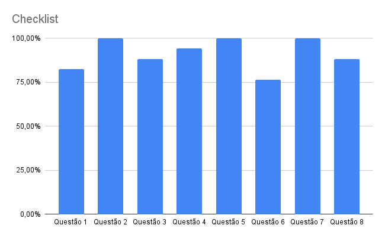

# Verificação - Léxicos

## Histórico de versões
| Data       | Versão | Descrição                | Autor                                            | Revisor                                      |
| ---------- | ------ | ------------------------ | ------------------------------------------------ | -------------------------------------------- |
| 22.03.2022 | 1.0    | Criação do documento     | [Matheus Calixto](https://github.com/matheuscvp) | [Amanda Nobre](https://github.com/AmandaNbr) |
| 22.04.2022 | 2.0    | Refatoração do documento | [Matheus Calixto](https://github.com/matheuscvp) | [Amanda Nobre](https://github.com/AmandaNbr) |

## Participantes

- [Matheus Calixto](https://github.com/matheuscvp)

## Metodologia

A técnica de verificação usada nos artefatos de [Léxicos](/2021.2-AntennaPod/modelagem/lexicos/) é a inspeção, aplicada a partir do seguinte checklist, que tem como objetivo validar a qualidade do documento e possíveis falhas/erros.

| ID  | Descrição                                         | Justificativa                                                                      |
| --- | ------------------------------------------------- | ---------------------------------------------------------------------------------- |
| 1   | Possui todas as informações necessárias?          | O Léxico deve ter todas as informações necessárias para entender o léxico          |
| 2   | Há apenas informações referentes a esse artefato? | O Léxico apresenta apenas informações referentes a sua explicação                  |
| 3   | As informações são concisas?                      | As informações do léxico deve estar resumido ao essencial                          |
| 4   | Uso de linguagem compreensível ao público?        | As informações do Léxico devem apresentar linguagem de fácil entendimento          |
| 5   | Possui classificação correta?                     | O léxico deve estar classificado corretamente entre ESTADO, OBJETO e AÇÃO          |
| 6   | Possui sinônimo correto?                          | O léxico deve possuir ao menos um sinonimo correto                                 |
| 7   | Possui impacto correto?                           | O impacto do léxico deve estar corretamente descrito                               |
| 8   | Possui noção correta?                             | A noção do léxico deve estar corretamente descrita                                 |

## Checklist
| Símbolo | Descrição |
| ------- | --------- |
| ✔      | Sim       |
| ❌      | Não       |

|     |                Léxico 01 - Duração                |     |
| :-: | :-----------------------------------------------: | :-: |
|  1  |     Possui todas as informações necessárias?      | ✔  |
|  2  | Há apenas informações referentes a esse artefato? | ✔  |
|  3  |           As informações são concisas?            | ✔  |
|  4  |    Uso de linguagem compreensível ao público?     | ✔  |
|  5  |           Possui classificação correta?           | ✔  |
|  6  |             Possui sinônimo correto?              | ✔  |
|  7  |              Possui impacto correto?              | ✔  |
|  8  |               Possui noção correta?               | ✔  |

|     |          Léxico 02 - Fila de reprodução           |     |
| :-: | :-----------------------------------------------: | :-: |
|  1  |     Possui todas as informações necessárias?      | ❌  |
|  2  | Há apenas informações referentes a esse artefato? | ✔  |
|  3  |           As informações são concisas?            | ✔  |
|  4  |    Uso de linguagem compreensível ao público?     | ✔  |
|  5  |           Possui classificação correta?           | ✔  |
|  6  |             Possui sinônimo correto?              | ❌  |
|  7  |              Possui impacto correto?              | ✔  |
|  8  |               Possui noção correta?               | ✔  |

|     |                 Léxico 03 - Novo                  |     |
| :-: | :-----------------------------------------------: | :-: |
|  1  |     Possui todas as informações necessárias?      | ✔  |
|  2  | Há apenas informações referentes a esse artefato? | ✔  |
|  3  |           As informações são concisas?            | ✔  |
|  4  |    Uso de linguagem compreensível ao público?     | ✔  |
|  5  |           Possui classificação correta?           | ✔  |
|  6  |             Possui sinônimo correto?              | ✔  |
|  7  |              Possui impacto correto?              | ✔  |
|  8  |               Possui noção correta?               | ✔  |

|     |       Léxico 04 - Velocidade de reprodução        |     |
| :-: | :-----------------------------------------------: | :-: |
|  1  |     Possui todas as informações necessárias?      | ✔  |
|  2  | Há apenas informações referentes a esse artefato? | ✔  |
|  3  |           As informações são concisas?            | ✔  |
|  4  |    Uso de linguagem compreensível ao público?     | ✔  |
|  5  |           Possui classificação correta?           | ✔  |
|  6  |             Possui sinônimo correto?              | ❌  |
|  7  |              Possui impacto correto?              | ✔  |
|  8  |               Possui noção correta?               | ✔  |

|     |                 Léxico 05 - Canal                 |     |
| :-: | :-----------------------------------------------: | :-: |
|  1  |     Possui todas as informações necessárias?      | ✔  |
|  2  | Há apenas informações referentes a esse artefato? | ✔  |
|  3  |           As informações são concisas?            | ✔  |
|  4  |    Uso de linguagem compreensível ao público?     | ✔  |
|  5  |           Possui classificação correta?           | ✔  |
|  6  |             Possui sinônimo correto?              | ✔  |
|  7  |              Possui impacto correto?              | ✔  |
|  8  |               Possui noção correta?               | ✔  |

|     |               Léxico 06 - Episódio                |     |
| :-: | :-----------------------------------------------: | :-: |
|  1  |     Possui todas as informações necessárias?      | ✔  |
|  2  | Há apenas informações referentes a esse artefato? | ✔  |
|  3  |           As informações são concisas?            | ✔  |
|  4  |    Uso de linguagem compreensível ao público?     | ✔  |
|  5  |           Possui classificação correta?           | ✔  |
|  6  |             Possui sinônimo correto?              | ✔  |
|  7  |              Possui impacto correto?              | ✔  |
|  8  |               Possui noção correta?               | ✔  |

|     |               Léxico 07 - Histórico               |     |
| :-: | :-----------------------------------------------: | :-: |
|  1  |     Possui todas as informações necessárias?      | ✔  |
|  2  | Há apenas informações referentes a esse artefato? | ✔  |
|  3  |           As informações são concisas?            | ❌  |
|  4  |    Uso de linguagem compreensível ao público?     | ✔  |
|  5  |           Possui classificação correta?           | ✔  |
|  6  |             Possui sinônimo correto?              | ❌  |
|  7  |              Possui impacto correto?              | ✔  |
|  8  |               Possui noção correta?               | ❌  |

|     |                Léxico 08 - PodCast                |     |
| :-: | :-----------------------------------------------: | :-: |
|  1  |     Possui todas as informações necessárias?      | ❌  |
|  2  | Há apenas informações referentes a esse artefato? | ✔  |
|  3  |           As informações são concisas?            | ❌  |
|  4  |    Uso de linguagem compreensível ao público?     | ❌  |
|  5  |           Possui classificação correta?           | ✔  |
|  6  |             Possui sinônimo correto?              | ❌  |
|  7  |              Possui impacto correto?              | ✔  |
|  8  |               Possui noção correta?               | ❌  |

|     |                Léxico 09 - Usuário                |     |
| :-: | :-----------------------------------------------: | :-: |
|  1  |     Possui todas as informações necessárias?      | ✔  |
|  2  | Há apenas informações referentes a esse artefato? | ✔  |
|  3  |           As informações são concisas?            | ✔  |
|  4  |    Uso de linguagem compreensível ao público?     | ✔  |
|  5  |           Possui classificação correta?           | ✔  |
|  6  |             Possui sinônimo correto?              | ✔  |
|  7  |              Possui impacto correto?              | ✔  |
|  8  |               Possui noção correta?               | ✔  |

|     |                Léxico 10 - Assinar                |     |
| :-: | :-----------------------------------------------: | :-: |
|  1  |     Possui todas as informações necessárias?      | ✔  |
|  2  | Há apenas informações referentes a esse artefato? | ✔  |
|  3  |           As informações são concisas?            | ✔  |
|  4  |    Uso de linguagem compreensível ao público?     | ✔  |
|  5  |           Possui classificação correta?           | ✔  |
|  6  |             Possui sinônimo correto?              | ✔  |
|  7  |              Possui impacto correto?              | ✔  |
|  8  |               Possui noção correta?               | ✔  |

|     |               Léxico 11 - Atualizar               |     |
| :-: | :-----------------------------------------------: | :-: |
|  1  |     Possui todas as informações necessárias?      | ✔  |
|  2  | Há apenas informações referentes a esse artefato? | ✔  |
|  3  |           As informações são concisas?            | ✔  |
|  4  |    Uso de linguagem compreensível ao público?     | ✔  |
|  5  |           Possui classificação correta?           | ✔  |
|  6  |             Possui sinônimo correto?              | ✔  |
|  7  |              Possui impacto correto?              | ✔  |
|  8  |               Possui noção correta?               | ✔  |

|     |                Léxico 12 - Baixar                 |     |
| :-: | :-----------------------------------------------: | :-: |
|  1  |     Possui todas as informações necessárias?      | ✔  |
|  2  | Há apenas informações referentes a esse artefato? | ✔  |
|  3  |           As informações são concisas?            | ✔  |
|  4  |    Uso de linguagem compreensível ao público?     | ✔  |
|  5  |           Possui classificação correta?           | ✔  |
|  6  |             Possui sinônimo correto?              | ✔  |
|  7  |              Possui impacto correto?              | ✔  |
|  8  |               Possui noção correta?               | ✔  |

|     |               Léxico 13 - Descobrir               |     |
| :-: | :-----------------------------------------------: | :-: |
|  1  |     Possui todas as informações necessárias?      | ✔  |
|  2  | Há apenas informações referentes a esse artefato? | ✔  |
|  3  |           As informações são concisas?            | ✔  |
|  4  |    Uso de linguagem compreensível ao público?     | ✔  |
|  5  |           Possui classificação correta?           | ✔  |
|  6  |             Possui sinônimo correto?              | ✔  |
|  7  |              Possui impacto correto?              | ✔  |
|  8  |               Possui noção correta?               | ✔  |

|     |               Léxico 14 - Favoritar               |     |
| :-: | :-----------------------------------------------: | :-: |
|  1  |     Possui todas as informações necessárias?      | ✔  |
|  2  | Há apenas informações referentes a esse artefato? | ✔  |
|  3  |           As informações são concisas?            | ✔  |
|  4  |    Uso de linguagem compreensível ao público?     | ✔  |
|  5  |           Possui classificação correta?           | ✔  |
|  6  |             Possui sinônimo correto?              | ✔  |
|  7  |              Possui impacto correto?              | ✔  |
|  8  |               Possui noção correta?               | ✔  |

|     |                Léxico 15 - Filtrar                |     |
| :-: | :-----------------------------------------------: | :-: |
|  1  |     Possui todas as informações necessárias?      | ✔  |
|  2  | Há apenas informações referentes a esse artefato? | ✔  |
|  3  |           As informações são concisas?            | ✔  |
|  4  |    Uso de linguagem compreensível ao público?     | ✔  |
|  5  |           Possui classificação correta?           | ✔  |
|  6  |             Possui sinônimo correto?              | ✔  |
|  7  |              Possui impacto correto?              | ✔  |
|  8  |               Possui noção correta?               | ✔  |

|     |               Léxico 16 - Pesquisar               |     |
| :-: | :-----------------------------------------------: | :-: |
|  1  |     Possui todas as informações necessárias?      | ✔  |
|  2  | Há apenas informações referentes a esse artefato? | ✔  |
|  3  |           As informações são concisas?            | ✔  |
|  4  |    Uso de linguagem compreensível ao público?     | ✔  |
|  5  |           Possui classificação correta?           | ✔  |
|  6  |             Possui sinônimo correto?              | ✔  |
|  7  |              Possui impacto correto?              | ✔  |
|  8  |               Possui noção correta?               | ✔  |

|     |              Léxico 17 - Reproduzir               |     |
| :-: | :-----------------------------------------------: | :-: |
|  1  |     Possui todas as informações necessárias?      | ✔  |
|  2  | Há apenas informações referentes a esse artefato? | ✔  |
|  3  |           As informações são concisas?            | ✔  |
|  4  |    Uso de linguagem compreensível ao público?     | ✔  |
|  5  |           Possui classificação correta?           | ✔  |
|  6  |             Possui sinônimo correto?              | ✔  |
|  7  |              Possui impacto correto?              | ✔  |
|  8  |               Possui noção correta?               | ✔  |

 
Figura 1 - gráfico de resultado  
Autor: Matheus Calixto

## Conclusão

Após a verificação foi observado que há vários erros na descrição dos léxicos PodCast e histórico. Há erros pontuais de ortografia e semanticas em alguns léxicos além de alguns não terem sinônimos.

## Referências

VAZQUEZ, Carlos Eduardo; SIQUEIRA SIMÕES, Guilerme. Engenharia de Requisitos: Software orientado ao negócio. 1. ed. rev. [S. l.: s. n.], 2016.