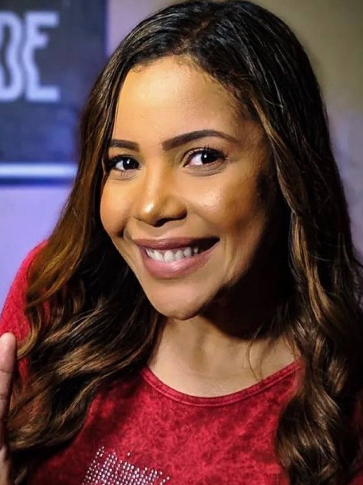
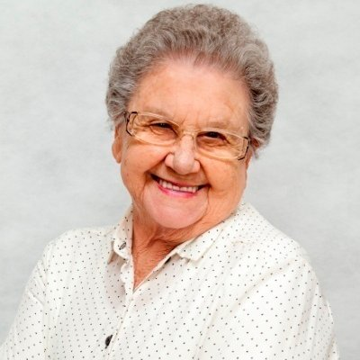

# Personas

## Histórico de versões
| Data       | Versão | Descrição            | Revisores | Autor(es)                            |
| ---------- | ------ | -------------------- | --------- | ------------------------------------ |
| 23.02.2022 | 0.1    | Criação do documento |           | Yudi Yamane, Abraão, Matheus Fonseca |

## Introdução

Uma persona é um personagem fictício que pertence a grupo de usuários e descreve as
características de um usuário típico. São definidas as partir dos objetivos do 
usuário que são descobertos quando é analisado o domínio da atividade do usuário
em um processo incremental.

## Personas

### Luana Moreira

<figure markdown>
  { width="200" }
  <figcaption> Imagem 1: persona Luana Moreira </figcaption>
  Fonte: UOL
</figure>

- Idade: 25
- Sexo: feminino
- Ocupação: Estudante de relações internacionais
- Escolaridade: Ensino superior incompleto

_"Quero me atualizar sobre o mundo de um jeito fácil"._

Luana ainda não tirou carteira de motorista e por isso seu meio de transporte para a universidade é o 
ônibus. Para aproveitar melhor o tempo da comuta, Luana gosta de ouvir podcasts sobre alguns
assuntos: política internacional, cultura pop e notícias locais. Além desse tempo de comuta, ela 
também escuta podcasts enquanto faz exercícios e tarefas domésticas.

Por ter um gosto não muito abrangente, Luana prefere favoritar os seus podcasts que mais lhe agradam
e receber notificações de novos episódios. Assim ela não precisa ficar se lembrando
de checar de tempos em tempos se há um novo episódio.

### Fabio Ribeiro

<figure markdown>
  { width="200" }
  <figcaption> Imagem 6: persona Fábio Ribeiro </figcaption>
  Fonte: thispersondoesnotexist
</figure>

- Idade: 34
- Sexo: Masculino
- Ocupação: Empreendedor
- Escolaridade: Ensino superior completo

_"Quero me atualizar sobre oportunidades de negocio"_

Fabio Ribeiro, 34 anos, é empreendedor desde que terminou sua faculdade e decidiu aprender mais sobre o mundo dos negócios para poder participar de mais perto sobre como as empresas funcionam e são criadas e mantidas para um melhor desenvolvimento dos seus projetos.

Fábio também gosta de ser manter sempre ligado a novas tecnologias, principalmente, para melhores inovações dentro de empresas, por isso, fábio vive ouvindo podcasts de empreendedorismo e tecnologia. E por ter querer se manter sempre antenado com tudo isso, ele gosta de receber notificações sempre que chegarem novos episódios de suas assinaturas assim que lançados.
### Dona Lurdes

<figure markdown>
  { width="200" }
  <figcaption> Imagem 6: antipersona Dona Lurdes </figcaption>
  Fonte: UOL
</figure>

- Idade: 68
- Sexo: feminino
- Ocupação: Aposentada
- Escolaridade: Ensino superior completo

_"Não sei mexer com tecnologia"._

Lurdes Pereira, 65 anos, trabalhava como bibliotecária da cidade. Desde sempre se interessou
muito por sistemas de organização, inventários e ajudar pessoas. Lê muitos livros desde a infância.
Livros de fantasia, romance, bibliografias, história mundial e autores filósofos. Lurdes é uma pessoa
analógica, prefere atas, livros, e telefone a computadores, celulares e kindles.

Lurdes tem um celular moderno com acesso à internet, mas ela o usa apenas para mandar mensagens no grupo da família e ligar para amigos. Seu principal meio de atualização é o jornal da noite. Quando está fazendo algo manual que não exige muita atenção, gosta de 
colocar um disco para tocar em sua vitrola.

## Referências

<!-- Feito aqui ó: https://referenciabibliografica.net/a/pt-br/ref/abnt -->

BARBOSA, Simone et al. Organização do espaço do problema: Personas. In: INTERAÇÃO Humano-Computador. 1. ed. [S. l.]: Elsevier, 2010. cap. 6, p. 176-183. ISBN 978-85-352-3418-3.