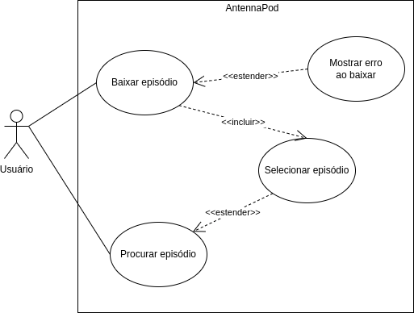

# Casos de Uso

## Histórico de versões
| Data       | Versão | Descrição                                | Autor(es)                                   | Revisores                                     |
| ---------- | ------ | ---------------------------------------- | ------------------------------------------- | --------------------------------------------- |
| 24.02.2022 | 1.0    | Criação do documento                     | [Yudi Yamane](https://github.com/yudi-azvd) | [Thaís Rebouças](https://github.com/Thais-ra) |
| 06.03.2022 | 2.0    | Movidos casos de uso para a mesma página | [Yudi Yamane](https://github.com/yudi-azvd) | [Amanda Nobre](https://github.com/AmandaNbr)  |
| 18.03.2022 | 3.0    | Movidos casos de uso para a mesma página | [Yudi Yamane](https://github.com/yudi-azvd) | [Thais Rebouças](https://github.com/Thais-ra) |
| 18.03.2022 | 4.0    | Correções após revisão da verificação    | [Yudi Yamane](https://github.com/yudi-azvd) | [Thais Rebouças](https://github.com/Thais-ra) |

[Casos de Uso v3](./casosDeUsoV3.md)

## Introdução

Um caso de uso descreve os vários passos de uma interação, de atividade 
individual, entre o sistema e um agente externo a fim de atingir um objetivo de
valor. O nome de um caso de uso é escrito com um verbo e um objeto, a exemplo:
"Ouvir um episódio".

Casos de uso podem ser representado tanto por diagramas UML quanto por tabelas.
Nos diagramas existem vários elementos gráficos como atores principais e secundários,
casos de uso, sistema, relacionamentos e etc. Por outro lado, as tabelas descrevem
as características: atores, descrição, pré condições, fluxos principais, alternativos
e de exceção, pós condições e rastreabilidade.

### Relacionamentos

São interações entre objetos de um diagrama de casos de uso, representados
por linhas ou setas. Tipos:

- **Associação**: relacionamento básico entre dois objetos. Exemplo: cliente realiza 
login.

- **Inclusão**: relacionamento entre casos de uso (UC) de maneira que se o UC A inclui
o UC B, então toda vez que UC A for executado, UC B também será executado. Exemplo:
Fazer login <<inclui\>\> Verificar senha. Em um diagrama, uma flecha pontilhada 
sai do UC Fazer login e chega no UC Verficar senha.

- **Extensão**: relacionamento entre casos de uso de maneira que o UC A acontece,
mas o UC B que estende A nem sempre acontece, ou seja, acontece somente mediante
a alguns critérios particulares. Exemplo: Mostrar tela de erro de login <<estende\>\>
Fazer login. Em um diagrama, uma flecha pontilhada sai do UC Mostrar tela de erro
de login e chega em Fazer login.

### Atores

Em casos de uso temos dois tipos de atores:

- **Atores principais**: atores que iniciam (trigger) o caso de uso. É quem realmente 
obtém valor do sucesso do caso de uso.

- **Atores secundários**: atores que respondem ao trigger do caso de uso. Participam
do caso de uso por trás das cortinas.

## Metodologia

Com base nos requisitos levantados, os casos de uso foram realizados em 
diagramas utilizando a ferramenta Draw.io. Os resultados podem ser observados clicando
nos links da lista de casos de uso logo abaixo.

## Participantes

- [Yudi Yamane](https://github.com/yudi-azvd)

## Resultado

### Caso de Uso 01: Baixar um episódio

#### Diagrama
<figure markdown>
  { width="400" }
  <figcaption> Diagrama caso de uso 01 </figcaption>
  Autor: Yudi Yamane
</figure>

#### Tabela

|                   |                                                                                                                                                                                                                                                                                                                                                                                                                                                                                                                                                                                                                                                                                                                                                                                                                                                                                                                                                                                                                                                                                                                                                                                                                                                                                                                                        |
| ----------------- | -------------------------------------------------------------------------------------------------------------------------------------------------------------------------------------------------------------------------------------------------------------------------------------------------------------------------------------------------------------------------------------------------------------------------------------------------------------------------------------------------------------------------------------------------------------------------------------------------------------------------------------------------------------------------------------------------------------------------------------------------------------------------------------------------------------------------------------------------------------------------------------------------------------------------------------------------------------------------------------------------------------------------------------------------------------------------------------------------------------------------------------------------------------------------------------------------------------------------------------------------------------------------------------------------------------------------------------- |
| ID e nome         | UC01: Baixar episódio                                                                                                                                                                                                                                                                                                                                                                                                                                                                                                                                                                                                                                                                                                                                                                                                                                                                                                                                                                                                                                                                                                                                                                                                                                                                                                                  |
| Data              | 24/02/2022                                                                                                                                                                                                                                                                                                                                                                                                                                                                                                                                                                                                                                                                                                                                                                                                                                                                                                                                                                                                                                                                                                                                                                                                                                                                                                                             |
| Ator Primário     | Usuário                                                                                                                                                                                                                                                                                                                                                                                                                                                                                                                                                                                                                                                                                                                                                                                                                                                                                                                                                                                                                                                                                                                                                                                                                                                                                                                                |
| Descrição         | O usuário especifica o episódio que existe e que deseja ser baixado digitando seu título na barra de pesquisa. Abrindo a página do episódio, ele pode clicar no botão de baixar. O aplicativo deve baixar o episódio e salvá-lo no celular do Usuário.                                                                                                                                                                                                                                                                                                                                                                                                                                                                                                                                                                                                                                                                                                                                                                                                                                                                                                                                                                                                                                                                                 |
| Pré-condição      | PRE-1: episódio deve existir    PRE-2: celular deve estar conectado à internet                                                                                                                                                                                                                                                                                                                                                                                                                                                                                                                                                                                                                                                                                                                                                                                                                                                                                                                                                                                                                                                                                                                                                                                                                                                      |
| Fluxo normal      | 1. Usuário acessa o AntennaPod  2. Usuário clica no botão de baixar episódio   3. Aplicativo remove botão de baixar   4. Aplicativo adiciona episódio à lista de episódios em processo de baixar   5. Aplicativo termina download   6. Aplicativo remove episódio da lista de episódios em processo de baixar                                                                                                                                                                                                                                                                                                                                                                                                                                                                                                                                                                                                                                                                                                                                                                                                                                                                                                                                                                                                        |
| Fluxo alternativo | 1. Usuário recebe notificação de episódio novo  2. Usuário clica na notificação   3. Segue o fluxo normal                                                                                                                                                                                                                                                                                                                                                                                                                                                                                                                                                                                                                                                                                                                                                                                                                                                                                                                                                                                                                                                                                                                                                                                                                        |
| Fluxo de exceção  | **Sem conexão à internet**   1. Usuário clica no botão de baixar episódio   2. Aplicativo mostra mensagem dizendo que não há conexão com a internet   e por isso o download não pode ser realizado   3. Aplicativo pergunta se Usuário que o download comece automaticamente   assim que for restabelecida a conexão com a internet   3.1 Usuário responde Sim   3.2 Aplicativo agenda o download e termina caso de uso   4.1 Usuário responde Não   4.2 Aplicativo termina caso de uso   **Sem espaço no dispositivo**  1. Usuário clica no botão de baixar episódio   2. Aplicativo mostra mensagem dizendo que não há conexão com a internet   e por isso o download não pode ser realizado. O aplicativo ainda recomenda    que o Usuário libere espaço no dispotivo excluindo arquivos e tente novamente  depois.  3. Aplicativo termina caso de uso.  **Usuário cancela download**  1. Usuário clica no botão de baixar episódio   2. Aplicativo remove botão de baixar   3. Aplicativo adiciona episódio à lista de episódios em processo de baixar   4. Usuário cancela o download do episódio   5. Aplicativo remove episódio da lista de episódios em processo de baixar   6. Aplicativo remove o pedaço do episódio que foi baixado até o momento   |
| Pós-condição      | POS-1: episódio baixado no celular do Usuário                                                                                                                                                                                                                                                                                                                                                                                                                                                                                                                                                                                                                                                                                                                                                                                                                                                                                                                                                                                                                                                                                                                                                                                                                                                                                          |
| Rastreabilidade   | RF02                                                                                                                                                                                                                                                                                                                                                                                                                                                                                                                                                                                                                                                                                                                                                                                                                                                                                                                                                                                                                                                                                                                                                                                                                                                                                                                                   |

### Caso de Uso 02: Assinar um podcast

#### Diagrama
<figure markdown>
  { width="400" }
  <figcaption> Diagrama caso de uso 02 </figcaption>
  Autor: Yudi Yamane
</figure>

#### Tabela

|                   |                                                                                                                                                                                                                                                                                                    |
| ----------------- | -------------------------------------------------------------------------------------------------------------------------------------------------------------------------------------------------------------------------------------------------------------------------------------------------- |
| ID e nome         | UC02: Assinar podcast                                                                                                                                                                                                                                                                              |
| Data              | 25/02/2022                                                                                                                                                                                                                                                                                         |
| Ator Primário     | Usuário                                                                                                                                                                                                                                                                                            |
| Descrição         | O usuário especifica o podcast que existe e que deseja assinar digitando seu título na barra de pesquisa. Abrindo a página do podcast, ele pode clicar no botão de assinar. O aplicativo deve assinar o podcast e adicioná-lo na lista de podcasts assinados do usuário.                           |
| Pré-condição      | PRE-1: podcast deve existir    PRE-2: celular deve estar conectado à internet                                                                                                                                                                                                                   |
| Fluxo normal      | 1. Usuário acessa o AntennaPod    2. Usuário digita o nome do podcast na barra de pesquisa   3. Usuário seleciona o podcast desejado no resultado da pesquisa para abrir o seu modal   4. Usuário aperta o botão de assinar                                                            |
| Fluxo alternativo | ---                                                                                                                                                                                                                                                                                                |
| Fluxo de exceção  | **Sem conexão à internet** 1. Usuário clica no botão de baixar episódio  2. Aplicativo mostra mensagem dizendo que não há conexão com a internet  e por isso não é possível assinar o podcast  **Podcast não encontrado**   1. Aplicativo mostra mensagem de podcast não encontrado |
| Pós-condição      | POS-1: podcast adicionado à lista de podcasts assinados do usuário                                                                                                                                                                                                                                 |
| Rastreabilidade   | RF26                                                                                                                                                                                                                                                                                               |

### Caso de Uso 03: Visualizar lista de podcasts assinados

#### Diagrama
<figure markdown>
  { width="400" }
  <figcaption> Diagrama caso de uso 03 </figcaption>
  Autor: Yudi Yamane
</figure>

#### Tabela

|                   |                                                                                                               |
| ----------------- | ------------------------------------------------------------------------------------------------------------- |
| ID e nome         | UC03: Visualizar lista de podcasts assinados                                                                  |
| Data              | 27/02/2022                                                                                                    |
| Ator Primário     | Usuário                                                                                                       |
| Descrição         | O usuário pode visualizar todos os podcasts que assinou em uma lista                                          |
| Pré-condição      | PRE-1: usuário deve ter assinado ao menos um podcast    PRE-2: dispositivo deve estar conectado à internet |
| Fluxo normal      | 1. Usuário acessa o AntennaPod   2. Clica no botão de listar podcastas assinados                        |
| Fluxo alternativo | ---                                                                                                           |
| Fluxo de exceção  | Usuário não assinou podcasts                                                                                  |
| Pós-condição      | ---                                                                                                           |
| Rastreabilidade   | RF10                                                                                                          |

### Caso de Uso 04: Receber notificações de episódios

#### Diagrama
<figure markdown>
  { width="400" }
  <figcaption> Diagrama caso de uso 01 </figcaption>
  Autor: Yudi Yamane
</figure>

#### Tabela

|                   |                                                                                                                                                            |
| ----------------- | ---------------------------------------------------------------------------------------------------------------------------------------------------------- |
| ID e nome         | UC04:  Receber notificações de episódios                                                                                                                   |
| Data              | 05/04/2022                                                                                                                                                 |
| Ator Primário     | Usuário                                                                                                                                                    |
| Descrição         | Depois que o usuário assina um podcast, ele pode receber as notificações de novos episódios desse podcast.                                                 |
| Pré-condição      | PRE-1: Usuário assinou o podcast                                                                                                                           |
| Fluxo normal      | 1. Usuário acessa o AntennaPod   2. Usuário clica no botão de listar notificações   3. Usuário visualiza notificações de novos episódios de podcasts |
| Fluxo alternativo | 1. Usuário acessa o AntennaPod   2. Usuário clica no botão de listar notificações   3. Não há notificação alguma porque não há novos episódios       |
| Fluxo de exceção  | ---                                                                                                                                                        |
| Pós-condição      | POS-1: Notificação de novo episódio está na lista de notificações do usuário.                                                                              |
| Rastreabilidade   | RF28                                                                                                                                                       |

## Referências

WIEGERS, Karl et al. Understanding user requirements. In: SOFTWARE Requirements. 3. ed. [S. l.: s. n.], 2013. cap. 8.