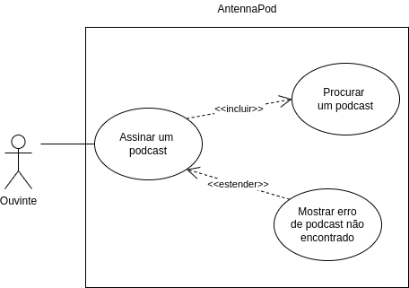

# Caso de Uso 01: Baixar um episódio

Esse caso de uso é apenas um dos vários que são listados nessa 
[página](../casosDeUso).

## Histórico de versões
| Data       | Versão | Descrição            | Revisores      | Autor(es)   |
| ---------- | ------ | -------------------- | -------------- | ----------- |
| 24.02.2022 | 1.0    | Criação do documento | Thais Rebouças | Yudi Yamane |

## Diagrama
<figure markdown>
  { width="400" }
  <figcaption> Diagrama caso de uso 02 </figcaption>
  Autor: Yudi Yamane
</figure>

## Tabela

|                   |                                                                                                                                                                                                                                                                          |
| ----------------- | ------------------------------------------------------------------------------------------------------------------------------------------------------------------------------------------------------------------------------------------------------------------------ |
| ID e nome         | UC02: Assinar podcast                                                                                                                                                                                                                                                    |
| Data              | 25/02/2022                                                                                                                                                                                                                                                               |
| Ator Primário     | Usuário                                                                                                                                                                                                                                                                  |
| Descrição         | O usuário especifica o podcast que existe e que deseja assinar digitando seu título na barra de pesquisa. Abrindo a página do podcast, ele pode clicar no botão de assinar. O aplicativo deve assinar o podcast e adicioná-lo na lista de podcasts assinados do usuário. |
| Pré-condição      | PRE-1: podcast deve existir    PRE-2: celular deve estar conectado à internet                                                                                                                                                                                         |
| Fluxo normal      | 1. Usuário acessa o AntennaPod    2. Usuário digita o nome do podcast na barra de pesquisa   3. Usuário seleciona o podcast desejado no resultado da pesquisa para abrir o seu modal   4. Usuário aperta o botão de assinar                                  |
| Fluxo alternativo | ---                                                                                                                                                                                                                                                                      |
| Fluxo de exceção  | **Sem conexão à internet**  1. Usuário clica no botão de baixar episódio  2. Aplicativo mostra mensagem dizendo que não há conexão com a internet  e por isso não é possível assinar o podcast                                                               |
| Pós-condição      | POS-1: podcast adicionado à lista de podcasts assinados do usuário                                                                                                                                                                                                       |
| Rastreabilidade   | RF26                                                                                                                                                                                                                                                                     |
