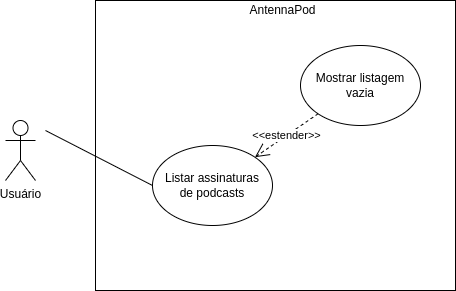

# Caso de Uso 03: Visualizar lista de podcasts assinados

Esse caso de uso é apenas um dos vários que são listados nessa 
[página](../casosDeUso).

## Histórico de versões
| Data       | Versão | Descrição            | Revisores      | Autor(es)   |
| ---------- | ------ | -------------------- | -------------- | ----------- |
| 27.02.2022 | 1.0    | Criação do documento | Thais Rebouças | Yudi Yamane |

## Diagrama
<figure markdown>
  { width="400" }
  <figcaption> Diagrama caso de uso 03 </figcaption>
  Autor: Yudi Yamane
</figure>

## Tabela

|                   |                                                                                                               |
| ----------------- | ------------------------------------------------------------------------------------------------------------- |
| ID e nome         | UC03: Visualizar lista de podcasts assinados                                                                  |
| Data              | 27/02/2022                                                                                                    |
| Ator Primário     | Ouvinte                                                                                                       |
| Descrição         | O ouvinte pode visualizar todos os podcasts que assinou em uma lista                                          |
| Pré-condição      | PRE-1: ouvinte deve ter assinado ao menos um podcast    PRE-2: dispositivo deve estar conectado à internet |
| Fluxo normal      | 1. Ouvinte acessa o AntennaPod   2. Clica no botão de listar podcastas assinados                        |
| Fluxo alternativo | ---                                                                                                           |
| Fluxo de exceção  | ---                                                                                                           |
| Pós-condição      | ---                                                                                                           |
| Rastreabilidade   | RF10                                                                                                          |
