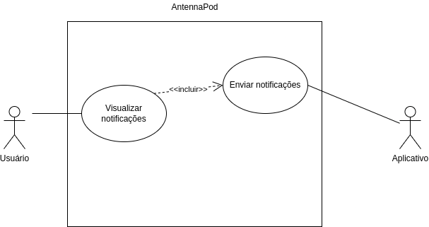

# Caso de Uso 04: Receber notificações de episódios

Esse caso de uso é apenas um dos vários que são listados nessa 
[página](../casosDeUso).

## Histórico de versões
| Data       | Versão | Descrição            | Revisores      | Autor(es)   |
| ---------- | ------ | -------------------- | -------------- | ----------- |
| 24.02.2022 | 1.0    | Criação do documento | Thais Rebouças | Yudi Yamane |

## Diagrama
<figure markdown>
  { width="400" }
  <figcaption> Diagrama caso de uso 01 </figcaption>
  Autor: Yudi Yamane
</figure>

## Tabela

|                   |                                                                                                                                                            |
| ----------------- | ---------------------------------------------------------------------------------------------------------------------------------------------------------- |
| ID e nome         | UC04:  Receber notificações de episódios                                                                                                                   |
| Data              | 05/04/2022                                                                                                                                                 |
| Ator Primário     | Usuário                                                                                                                                                    |
| Descrição         | Depois que o usuário assina um podcast, ele pode receber as notificações de novos episódios desse podcast.                                                 |
| Pré-condição      | PRE-1: Usuário assinou o podcast                                                                                                                           |
| Fluxo normal      | 1. Usuário acessa o AntennaPod   2. Usuário clica no botão de listar notificações   3. Usuário visualiza notificações de novos episódios de podcasts |
| Fluxo alternativo | 1. Usuário acessa o AntennaPod   2. Usuário clica no botão de listar notificações   3. Não há notificação alguma porque não há novos episódios       |
| Fluxo de exceção  | ---                                                                                                                                                        |
| Pós-condição      | POS-1: Notificação de novo episódio está na lista de notificações do usuário.                                                                              |
| Rastreabilidade   | RF28                                                                                                                                                       |
