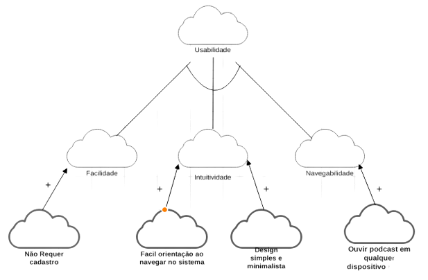
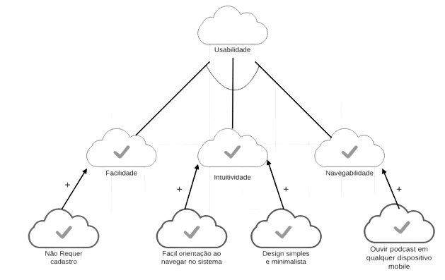

# NFR Framework

## Histórico de versão
| Data       | Versão | Descrição                                 | Autor                                         | Revisor                                     |
| ---------- | ------ | ----------------------------------------- | --------------------------------------------- | ------------------------------------------- |
| 03.03.2022 | 1.0    | Criação do documento e adição de conteudo | [Abraão Alves](https://github.com/Abraao1231) | [Yudi Yamane](https://github.com/yudi-azvd) |
| 05.03.2002 | 1.2    | Criação de diagramas                      | [Abraão Alves](https://github.com/Abraao1231) | [Yudi Yamane](https://github.com/yudi-azvd) |

##  Introdução 
O NFR Framework é uma abordagem proposta por Chung na universidade de Toronto para representar e analisar Requisitos Não-Funcionais. Seu objetivo é ajudar desenvolvedores na implementação de soluções personalizadas, levando em consideração as características do domínio e do sistema em questão. Tais características incluem Requisitos Não-funcionais, Requisitos funcionais, prioridades e carga de
trabalho. 

O framework utiliza as softgoals para representar os requisitos não-funcionais, e também, possui um método de análise qualitativa para decidir os status dos softgoals, dado que outros softgoals relacionados foram ou não satisfeitos.

## Metodologia 
Através desse documento queremos definir as funcionalidades dos requisitos através das possiveis analises, que serão feitas depois da implementação dos diagramas do NFR Framework. Para a criação dos diagramas foi utilizada a ferramenta EdrawMax.

## Requisitos não funcionais

Abaixo estão listados os requisitos não-funcionais levantados pelas das técnicas de elicitação utilizadas no projeto, que serão os mesmos utilizados no NFR Framework.

| ID    | Descrição                                               | Técnica    |
| ----- | ------------------------------------------------------- | ---------- |
| RNF01 | O aplicativo deve ser fácil de ser utilizado            | Brainstorm |
| RNF02 | O aplicativo deverá rodar em qualquer plataforma mobile | Brainstorm |
| RNF03 | O sistema não requere cadastro                          | Brainstorm |
| RNF04 | Ouvir podcast em qualquer dispositivo mobile            | Brainstorm |

## Legenda

<figure markdown>
  { width="300" }
  <figcaption> Imagem 1: elementos de definição do NFR Framework </figcaption>
</figure>
<figure markdown>
  { width="500" }
  <figcaption> Imagem 2: elementos de relacionamento do NFR Framework </figcaption>
</figure>

## Diagramas
### Diagrama de usabilidade
<figure markdown>
  { width="500" }
  <figcaption> Imagem 3: Diagrama NFR Framework de usabilidade </figcaption>
</figure>

### Diagrama de usabilidade com propagação
<figure markdown>
  { width="500" }
  <figcaption> Imagem 4: Diagrama NFR Framework de usabilidade com propagação </figcaption>
</figure>

## Referências

SILVA, Reinaldo Antônio da. NFR4ES:Um Catálogo de Requisitos Não-Funcionais para Sistemas Embarcados. Recife, 201
