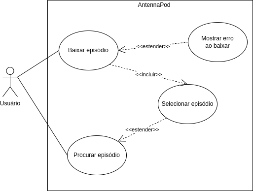

# Caso de Uso 01: Baixar um episódio

Esse caso de uso é apenas um dos vários que são listados nessa 
[página](../casosDeUso).

## Histórico de versões
| Data       | Versão | Descrição            | Revisores | Autor(es)   |
| ---------- | ------ | -------------------- | --------- | ----------- |
| 24.02.2022 | 0.1    | Criação do documento |           | Yudi Yamane |

## Diagrama
<figure markdown>
  { width="400" }
  <figcaption> Diagrama caso de uso 01 </figcaption>
  Autor: Yudi Yamane
</figure>

## Tabela

|                   |                                                                                                                                                                                                                                                                                                                                                                                                                                                                                                                                                                                                                                                                                                                                                                                                                                                                                                                                                                                                                                                                                                                                                                                                                                                                                                       |
| ----------------- | ----------------------------------------------------------------------------------------------------------------------------------------------------------------------------------------------------------------------------------------------------------------------------------------------------------------------------------------------------------------------------------------------------------------------------------------------------------------------------------------------------------------------------------------------------------------------------------------------------------------------------------------------------------------------------------------------------------------------------------------------------------------------------------------------------------------------------------------------------------------------------------------------------------------------------------------------------------------------------------------------------------------------------------------------------------------------------------------------------------------------------------------------------------------------------------------------------------------------------------------------------------------------------------------------------- |
| ID e nome         | UC01: Baixar episódio                                                                                                                                                                                                                                                                                                                                                                                                                                                                                                                                                                                                                                                                                                                                                                                                                                                                                                                                                                                                                                                                                                                                                                                                                                                                                 |
| Data              | 24/02/2022                                                                                                                                                                                                                                                                                                                                                                                                                                                                                                                                                                                                                                                                                                                                                                                                                                                                                                                                                                                                                                                                                                                                                                                                                                                                                            |
| Ator Primário     | Ouvinte                                                                                                                                                                                                                                                                                                                                                                                                                                                                                                                                                                                                                                                                                                                                                                                                                                                                                                                                                                                                                                                                                                                                                                                                                                                                                               |
| Ator secundário   | ---                                                                                                                                                                                                                                                                                                                                                                                                                                                                                                                                                                                                                                                                                                                                                                                                                                                                                                                                                                                                                                                                                                                                                                                                                                                                                                   |
| Descrição         | O ouvinte especifica o episódio que existe e que deseja ser baixado digitando seu título na barra de pesquisa. Abrindo a página do episódio, ele pode clicar no botão de baixar. O aplicativo deve baixar o episódio e salvá-lo no celular do ouvinte.                                                                                                                                                                                                                                                                                                                                                                                                                                                                                                                                                                                                                                                                                                                                                                                                                                                                                                                                                                                                                                                |
| Pré-condição      | PRE-1: episódio deve existir    PRE-2: celular deve estar conectado à internet                                                                                                                                                                                                                                                                                                                                                                                                                                                                                                                                                                                                                                                                                                                                                                                                                                                                                                                                                                                                                                                                                                                                                                                                                     |
| Fluxo normal      | 1. Ouvinte acessa o AntennaPod  2. Ouvinte clica no botão de baixar episódio   3. Aplicativo remove botão de baixar   4. Aplicativo adiciona episódio à lista de episódios em processo de baixar   5. Aplicativo termina download   6. Aplicativo remove episódio da lista de episódios em processo de baixar                                                                                                                                                                                                                                                                                                                                                                                                                                                                                                                                                                                                                                                                                                                                                                                                                                                                                                                                                                       |
| Fluxo alternativo | ---                                                                                                                                                                                                                                                                                                                                                                                                                                                                                                                                                                                                                                                                                                                                                                                                                                                                                                                                                                                                                                                                                                                                                                                                                                                                                                   |
| Fluxo de exceção  | **Sem conexão à internet**   1. Ouvinte clica no botão de baixar episódio   2. Aplicativo mostra mensagem dizendo que não há conexão com a internet   e por isso o download não pode ser realizado   3. Aplicativo pergunta se ouvinte que o download comece automaticamente   assim que for restabelecida a conexão com a internet   3.1 Ouvinte responde Sim   3.2 Aplicativo agenda o download e termina caso de uso   4.1 Ouvinte responde Não   4.2 Aplicativo termina caso de uso   **Sem espaço no dispositivo**  1. Ouvinte clica no botão de baixar episódio   2. Aplicativo mostra mensagem dizendo que não há conexão com a internet   e por isso o download não pode ser realizado. O aplicativo ainda recomenda    que o ouvinte libere espaço no dispotivo excluindo arquivos e tente novamente  depois.  3. Aplicativo termina caso de uso.  **Ouvinte cancela download**  1. Ouvinte clica no botão de baixar episódio   2. Aplicativo remove botão de baixar   3. Aplicativo adiciona episódio à lista de episódios em processo de baixar   4. Ouvinte cancela o download do episódio   5. Aplicativo remove episódio da lista de episódios em processo de baixar   6. Aplicativo remove o pedaço do episódio que foi baixado até o momento   |
| Pós-condição      | POS-1: episódio baixado no celular do ouvinte                                                                                                                                                                                                                                                                                                                                                                                                                                                                                                                                                                                                                                                                                                                                                                                                                                                                                                                                                                                                                                                                                                                                                                                                                                                         |
| Rastreabilidade   | RF02                                                                                                                                                                                                                                                                                                                                                                                                                                                                                                                                                                                                                                                                                                                                                                                                                                                                                                                                                                                                                                                                                                                                                                                                                                                                                                  |
