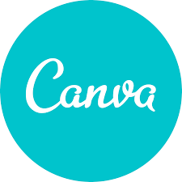

## Histórico de Versão

<table class="table table-striped border">
    <thead>
        <th>Data</th> 
        <th>Versão </th> 
        <th>Descrição</th> 
        <th>Autor(es)</th>
    </thead>
    <tbody>
        <tr>
            <td> 03.02.2022 </td>
            <td>  0.1   </td>
            <td> Criação do documento </td>
            <td> Amanda Nobre, Abraão  </td>
        </tr>
    </tbody>
</table>

# Heatmap

O Heatmap é uma excelente maneira de mapear quais são os dias da semana e o horário em que
    existe maior disponibilidade das pessoas, essa tabela mostra quantas pessoas estão disponíveis
    em cada dia e cada horário da semana. A tabela completa com a disponibilidade individual
    está disponível no
    <a href="link"> Drive</a>.

# Rich Picture

 texto sobre rich picture

# Cronograma

### 1ª entrega
##### **De xx/xx até xx/xx**

<table class="table table-striped border" style="color:black;">
    <thead style="background-color: #036ca3;">
        <th>Tarefa</th>
        <th>Participante(s)</th>
        <th>Revisor(es)</th>
        <th>Entrega</th>
    </thead>
    <tbody>
        <tr>
            <td>Cronograma</td>
            <td>Amanda e Abraão</td>
            <td>Matheus</td>
            <td>03/02</td>
        </tr>
        <tr>
            <td>HeatMap</td>
            <td>Amanda</td>
            <td>Bruna</td>
            <td>03/02</td>
        </tr>
        <tr>
            <td>Rich Picture</td>
            <td>Yudi</td>
            <td>Thais</td>
            <td>03/02</td>
        </tr>
    </tbody>
</table>

### 2ª entrega
##### **De xx/xx até xx/xx**

<table class="table table-striped border" style="color:black;">
    <thead style="background-color: #036ca3;">
        <th>Tarefa</th>
        <th>Participante(s)</th>
        <th>Revisor(es)</th>
        <th>Estimativa de Entrega</th>
    </thead>
    <tbody>
    </tbody>
</table>

### 3ª entrega
##### **De xx/xx até xx/xx**

<table class="table table-striped border" style="color:black;">
    <thead style="background-color: #036ca3;">
        <th>Tarefa</th>
        <th>Participante(s)</th>
        <th>Revisor(es)</th>
        <th>Estimativa de Entrega</th>
    </thead>
    <tbody>
    </tbody>
</table>

### 4ª entrega
##### **De xx/xx até xx/xx**

<table class="table table-striped border" style="color:black;">
    <thead style="background-color: #036ca3;">
        <th>Tarefa</th>
        <th>Participante(s)</th>
        <th>Revisor(es)</th>
        <th>Estimativa de Entrega</th>
    </thead>
    <tbody>
    </tbody>
</table>

### 5ª entrega
##### **De xx/xx até xx/xx**

<table class="table table-striped border" style="color:black;">
    <thead style="background-color: #036ca3;">
        <th>Tarefa</th>
        <th>Participante(s)</th>
        <th>Revisor(es)</th>
        <th>Estimativa de Entrega</th>
    </thead>
    <tbody>
    </tbody>
</table>

### 6ª entrega
##### **De xx/xx até xx/xx**

<table class="table table-striped border" style="color:black;">
    <thead style="background-color: #036ca3;">
        <th>Tarefa</th>
        <th>Participante(s)</th>
        <th>Revisor(es)</th>
        <th>Estimativa de Entrega</th>
    </thead>
    <tbody>
    </tbody>
</table>

# Ferramentas

	

		

			
			
O GitHub será utilizado para rastramento de tarefas (issues) e hospedagem do site da documentação.

		

		

			
			
O Discord será utilizado para chamadas em grupo.

		

		

			
			
O Telegram será utilizado para a comunicação da equipe.

		

	

	

		

			
			
O Canva será utilizado para confecção de slides para apresentação.

			

        

            
            
O Microsoft Teams será utilizado para a gravação dos vídeos em equipe.

        

        

            
            
O Draw.io será utilizado para confecção de diagramas.

        

	

