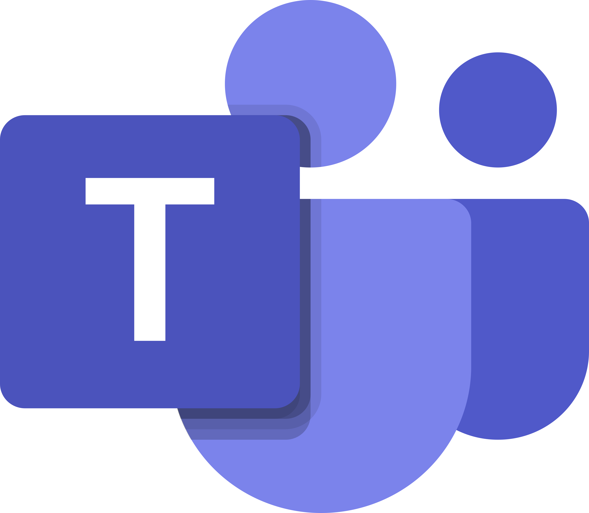

# Planejamento
## Histórico de Versão

| Data         | Versão   | Descrição              | Autor(es)               |
|--------------|----------|------------------------|-------------------------|
|  03.02.2022  |   0.1    |  Criação do documento  |  Amanda Nobre, Abraão   |

## Heatmap

O Heatmap mostra quantas pessoas da equipe estão disponiveis em determinados horários e dias. A tabela com as disponibilidades individuais está disponível no
    <a href="https://docs.google.com/spreadsheets/d/1BLhhFdXQga0X0WAd7KLn-UkEZvHdPkqJEjPx4qN1C4I/edit?usp=sharing"> Google Sheets</a>.

## Rich Picture

 O Rich picture é uma forma de visualizar como um sistema se comporta, identificando atores, ações e consequências e colocando fronteiras no sistema.

## Cronograma

### 1ª entrega: de 24/01 até 06/02

| Tarefa       | Participante(s) | Revisor(es) | Entrega |
|--------------|-----------------|-------------|---------|
| Cronograma   | Amanda e Abraão | Matheus Fonseca    | 03/02   |
| HeatMap      | Amanda          | matheus Calixto       | 03/02   |
| Rich Picture | Yudi            | Thais       | 03/02   |

### 2ª entrega: de 06/02 até 20/02
| Tarefa       | Participante(s) | Revisor(es) | Estimativa de Entrega |
|--------------|-----------------|-------------|-----------------------|
| Técnicas     | A decidir       | A decidir   | 18/02                 |
| Priorizações | A decidir       | A decidir   | 18/02                 |

### 3ª entrega: de 20/02 até 06/03

| Tarefa                    | Participante(s) | Revisor(es) | Estimativa de Entrega |
|---------------------------|-----------------|-------------|-----------------------|
| Cenários                  | A decidir       | A decidir   | 04/03                 |
| Léxico                    | A decidir       | A decidir   | 04/03                 |
| Especificação Suplementar | A decidir       | A decidir   | 04/03                 |
| Use Case                  | A decidir       | A decidir   | 04/03                 |

### 4ª entrega: de 06/03 até 09/03

| Tarefa                       | Participante(s) | Revisor(es) | Estimativa de Entrega |
|-----------------------------------------------------|-----------------|-------------|-----------------------|
| Ágil (Histórias de Usuário, Backlogs) NFR Framework | A decidir       | A decidir   | 07/03                 |

### 5ª entrega: de 09/03 até 23/03
| Tarefa      | Participante(s) | Revisor(es) | Estimativa de Entrega |
|-------------|-----------------|-------------|-----------------------|
| Verificação | A decidir       | A decidir   | 21/03                 |
| Validação   | A decidir       | A decidir   | 21/03                 |

### 6ª entrega: de 23/03 até 03/04

| Tarefa                           | Participante(s) | Revisor(es) | Estimativa de Entrega |
|----------------------------------|-----------------|-------------|-----------------------|
| Pós-Rastreabilidade: Gerência II | A decidir       | A decidir   | 01/04                 |

### 7ª entrega: de 03/04 até 25/04

| Tarefa                   | Participante(s) | Revisor(es) | Estimativa de Entrega |
|--------------------------|-----------------|-------------|-----------------------|
| Entrega do projeto final | Todos           | Yudi        |                       |

## Ferramentas

|Ferramenta|Descrição|
|-|-|
||O GitHub será utilizado para rastramento de tarefas (issues) e hospedagem do site da documentação.|
||O Discord será utilizado para chamadas em grupo.|
||O Telegram será utilizado para a comunicação da equipe.|
||O Canva será utilizado para confecção de slides para apresentação.|
||O Microsoft Teams será utilizado para a gravação dos vídeos em equipe.|
||O Draw.io será utilizado para confecção de diagramas.|

