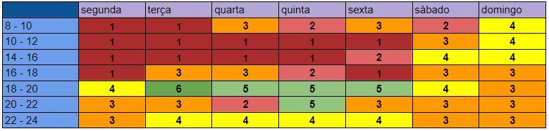

# Heatmap

O Heatmap mostra quantas pessoas da equipe estão disponiveis em determinados horários e dias.

## Histórico de Versão

| Data         | Versão   | Descrição              | Autor(es)               |
|--------------|----------|------------------------|-------------------------|
|  03.02.2022  |   0.1    |  Criação do documento e criação do headmap  |  Amanda Nobre, Abraão   |
|  03.02.2022  |   0.2    |  Revisão do headmap  |  Matheus Calixto   |
|  18.02.2022  |   0.3    |  Criação de uma nova versão do documento  |  Thaís Rebouças   |

 
Figura 1 - Heatmap da Equipe  
Autora: Amanda 

 A tabela com as disponibilidades individuais está disponível no
    <a href="https://docs.google.com/spreadsheets/d/1BLhhFdXQga0X0WAd7KLn-UkEZvHdPkqJEjPx4qN1C4I/edit?usp=sharing"> Google Sheets</a>.

