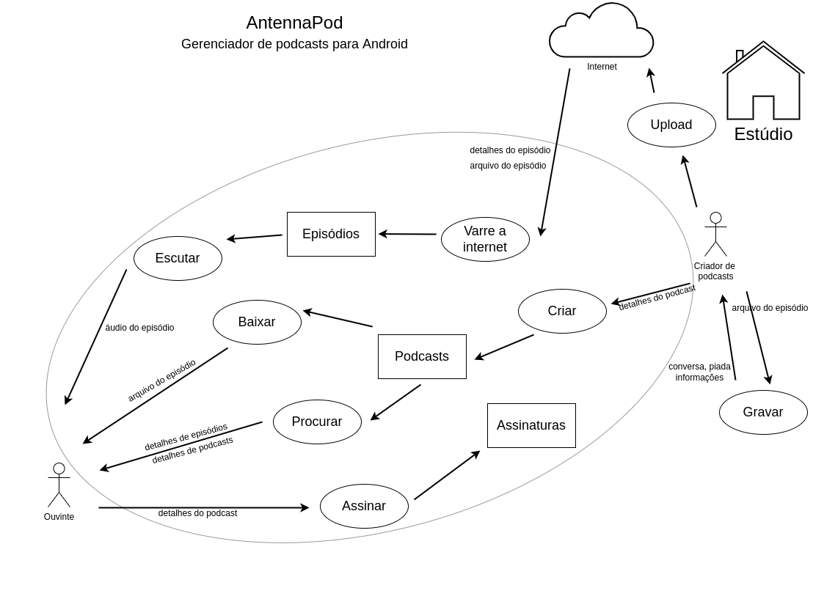

# RichPicture

## Histórico de versões
| Data         | Versão   | Descrição              | Autor(es)               |
|--------------|----------|------------------------|-------------------------|
|  10.02.2022  |   0.1    |  Criação do documento  |  Amanda Nobre           |
|  11.02.2022  |   0.2    |  Atualização do rich picture  |  Yudi Yamane           |

## Introdução

O Rich picture é uma forma de explorar, reconhecer e definir como um sistema se comporta através de diagramas, identificando atores envolvidos no produto e suas responsabilidades, os relacionamentos entre os processos e os atores, e por fim, colocando fronteiras no sistema.

## Versões do RichPicture

### Versão 1.0

A primeira versão do RichPicture do projeto foi feita a mão, quase que como um protótipo, para passar pela aprovação da equipe.

 
Figura 1 - RichPicture versão 1.0  
Autora: Thais

### Versão 2.0

A segunda e última versão do RichPicture, diferente da primeira, foi feita na ferramenta Draw.io. Nenhuma
mudança significativa foi feita, apenas deixando o artefato digital.

 
Figura 2 - RichPicture versão 2.0  
Autor: Yudi

## Referências

BELL, Simon et al. **Rich Pictures: Encouraging Resilient Communities**. Londres: Routledge, 2016.