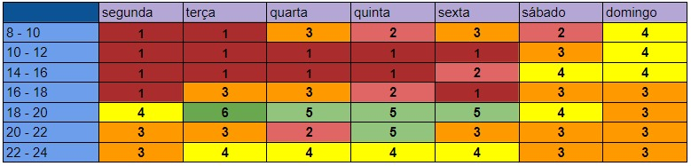

# Título

## Histórico de versões
| Data       | Versão | Descrição            | Autor        | Revisor |
| ---------- | ------ | -------------------- | ------------ | ------- |
| 10.02.2022 | 0.1    | Criação do documento | Amanda Nobre | Thais   |

## Introdução

Introduçao explicando o artefato ou a técnica.

## Metodologia

Explicação de como a equipe usou a técnica/criou o artefato: Em qual plataforma foi a reunião, quanto tempo durou, data da reunião, passos que o grupo seguiu e outras informações que o grupo julgar pertinente.

## Participantes

- Nome 1
- Nome 2

## Resultados

Resultados da técnica/artefato.

*Para imagens é necessário seguir a formatação:

(IMAGEM)  
Figura n - Título da imagem  
Autor ou Fonte

Exemplo:

 
Figura 1 - Heatmap da Equipe  
Autora: Amanda 

### Subtópico

Texto do subtópico.

## Referências

As referências devem estar em formato ABNT.